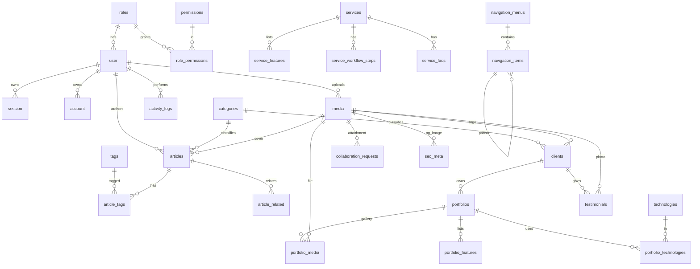

# 05 · Database Schema & ERD

**DB:** Cloudflare D1 (SQLite) via Drizzle ORM.
**Konvensi:** PK `id` = `text` (CUID2); timestamp = `integer` epoch (Drizzle `mode:'timestamp'`); boolean = `integer` 0/1; enum = `text` + Zod; FK `on delete` eksplisit; `slug`/`email`/`key` = UNIQUE index.

## Domain: Auth & RBAC
- **user** (Better Auth, diperluas): id · name · email(UNIQUE) · email_verified(bool) · image · **role_id** FK→roles(RESTRICT) · is_active(bool) · created_at · updated_at
- **session** / **account** / **verification**: skema Better Auth (session token/expires/user_id/ip/ua; account menyimpan password ter-hash; verification token).
- **roles**: id · name(UNIQUE: owner/editor/sales) · description · is_system(bool) · timestamps
- **permissions**: id · key(UNIQUE, mis. `article.create`) · description
- **role_permissions**: role_id FK · permission_id FK · **PK(role_id, permission_id)**

## Domain: Taksonomi & Media
- **categories**: id · name · slug · type(article|portfolio|client) · description · **UNIQUE(type, slug)** · timestamps
- **tags**: id · name · slug(UNIQUE) · created_at
- **technologies**: id · name · slug(UNIQUE) · icon_media_id FK(nullable)
- **media**: id · r2_key(UNIQUE) · url · filename · mime_type · size · kind(image|pdf|document) · width · height · alt · uploaded_by FK→user · created_at

## Domain: Articles
- **articles**: id · title · slug(UNIQUE) · summary · cover_media_id FK(SET NULL) · author_id FK→user(RESTRICT) · category_id FK(nullable) · content_json(Tiptap, sumber kebenaran) · content_html(cache tersanitasi) · reading_time · status(draft|scheduled|published) · scheduled_at · published_at · timestamps
  - Index: slug, status, published_at, category_id
- **article_tags**: article_id FK · tag_id FK · **PK(article_id, tag_id)**
- **article_related**: article_id FK · related_article_id FK · **PK(...)**

## Domain: Portfolio
- **portfolios**: id · title · slug(UNIQUE) · summary · challenge · solution · timeline · status(ongoing|completed|archived) · demo_url · repo_url · thumbnail_media_id FK · cover_media_id FK · client_id FK(nullable) · is_confidential(bool) · order · timestamps
- **portfolio_media** (gallery): id · portfolio_id FK · media_id FK · caption · order
- **portfolio_features**: id · portfolio_id FK · title · description · order
- **portfolio_technologies**: portfolio_id FK · technology_id FK · **PK(...)**

## Domain: Services
- **services**: id · name · slug(UNIQUE) · description · icon_media_id FK(nullable) · price(nullable) · cta_label · cta_url · status(active|inactive) · order · timestamps
- **service_features**: id · service_id FK · title · description · order
- **service_workflow_steps**: id · service_id FK · step_number · title · description
- **service_faqs**: id · service_id FK · question · answer · order

## Domain: Clients & Testimonials (v1.0)
- **clients**: id · name · slug(UNIQUE) · logo_media_id FK · category_id FK · website_url(nullable) · is_nda(bool) · order · timestamps
- **testimonials**: id · author_name · author_role · company · photo_media_id FK(nullable) · content · rating(1–5) · status(draft|published) · client_id FK(nullable) · order · timestamps

## Domain: Lead
- **collaboration_requests**: id · name · email · whatsapp · company · budget · deadline · project_type · description · attachment_media_id FK(nullable) · status(new|contacted|negotiation|proposal_sent|deal|completed|closed) · admin_notes · created_at · updated_at (Index: status, created_at)
- **contact_messages**: id · name · email · subject · message · status(new|read|replied) · created_at

## Domain: Situs (v1.0)
- **navigation_menus**: id · key(UNIQUE: header|footer) · name
- **navigation_items**: id · menu_id FK · label · url · parent_id FK→self(nullable) · target · order
- **settings**: id · key(UNIQUE) · value(text/JSON) · group
- **seo_meta** (polimorfik): id · entity_type · entity_id(nullable) · meta_title · meta_description · og_image_media_id FK · canonical_url · keywords · json_ld · no_index(bool) · **UNIQUE(entity_type, entity_id)**
- **activity_logs**: id · user_id FK→user · action · entity_type · entity_id · metadata(JSON) · ip_address · created_at (Index: user_id, entity_type, created_at)

## Catatan Desain (trade-off)
- `categories` satu tabel + kolom `type` (DRY; validasi type di aplikasi).
- `seo_meta` polimorfik → memusatkan SEO Manager (alternatif: kolom SEO tertempel di tiap tabel, lebih type-safe tapi duplikatif).
- `content_html` = cache sanitasi dari `content_json` (anti-XSS, render cepat); sumber kebenaran = `content_json`.

## ERD (Mermaid)

