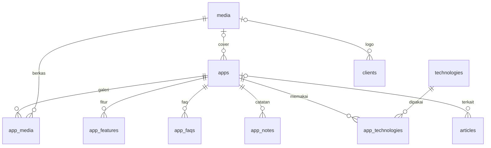

# 09 · Perombakan: WalDev sebagai Arsip Aplikasi

**Status:** Disetujui pemilik 2026-09-12 · Tahap 1–4 selesai, Tahap 5 (tayang) berjalan · Revisi beranda & klien 2026-09-12 (§15)
**Hubungan dengan dokumen lain:** dokumen 01–08 menggambarkan arah lama (situs jasa studio). Bila ada yang bertentangan, dokumen ini yang berlaku. Dokumen lama tetap disimpan sebagai riwayat.

## 1. Ringkasan
WalDev berubah dari situs jasa studio menjadi **arsip aplikasi yang dibangun dan dirawat pemiliknya**. Tujuannya reputasi jangka panjang, bukan jualan atau mencari proyek. Karena itu tidak ada harga, WhatsApp, testimoni, atau formulir prospek. Logo klien yang pernah bekerja sama tetap tampil di beranda sebagai bukti kerja. Setiap aplikasi punya halaman yang menjelaskannya secara lengkap, dan tulisan menempel ke aplikasinya. Kode yang ada **dirombak**, tidak ditulis ulang dari nol.

## 2. Keputusan
| Topik | Keputusan |
|---|---|
| Tujuan situs | Arsip & reputasi jangka panjang |
| Nama | Tetap **WalDev**; pemilik tampil sebagai pembuat (nama, foto, cerita singkat) di halaman Tentang |
| Suara tulisan | Tanpa kata "saya": pelaku disebut langsung (WalDev, nama aplikasi, atau nama pemilik). Menggantikan suara orang pertama |
| Tagline | Build Digital Products |
| Halaman aplikasi | Halaman produk yang lengkap untuk calon pemakai, bukan studi kasus |
| Isi saat tayang | Tayang sambil membangun; situs WalDev sendiri jadi entri pertama |
| Status yang tampil | Sedang dibangun · Sudah rilis · Tidak aktif. Yang berhenti sebelum rilis disembunyikan |
| Beranda | Hero (judul, ajakan, tangkapan layar aplikasi terbaru) · logo klien · daftar aplikasi · tulisan terbaru |
| Struktur halaman aplikasi | Bagian wajib + bagian opsional yang dinyalakan per aplikasi |
| Tulisan | Catatan pendek per aplikasi + artikel panjang sesekali; 3 tulisan terbaru tampil di beranda; menu Artikel belum tampil |
| Tanggal | Tanggal catatan terakhir ditampilkan apa adanya |
| Modul jasa | Dihapus, kecuali Klien yang dipulihkan untuk logo di beranda; kontak tersisa email & tautan sosial |
| Halaman publik | Berkas statis hasil `pnpm terbitkan` karena paket Workers Free ([10 · Rencana Tayang](./10-rencana-tayang.md) §5) |
| Tampilan | Gaya Plain v3 dipertahankan |
| Domain | Domain baru bernama WalDev (dibeli pemilik) |
| Cara membangun | Rombak repo ini |

## 3. Ukuran keberhasilan
- Situs ini jadi tautan yang pemilik kirim setiap kali ditanya "sudah bikin apa saja?".
- Setiap aplikasi berstatus *Sedang dibangun* punya catatan dalam 30 hari terakhir (dipantau di Ringkasan panel, §7.2).
- Lighthouse ≥ 95 di keempat kategori tetap terjaga.

Jumlah pengunjung **bukan** ukuran keberhasilan.

## 4. Informasi arsitektur
### 4.1 Situs publik
| Rute | Isi | Perubahan |
|---|---|---|
| `/` | Hero, logo klien, daftar aplikasi, tulisan terbaru | Dirombak total, direvisi (§5.1) |
| `/apps/[slug]` | Halaman aplikasi | Baru, menggantikan `/portfolio/[slug]` |
| `/articles` · `/articles/[slug]` | Daftar & isi artikel | Tetap, tidak ada di menu bawaan |
| `/about` | Pembuat, cerita, kontak | Dirombak |
| `/privacy-policy` | Kebijakan privasi | Tetap, isinya disederhanakan (tidak ada lagi formulir) |
| 404 | Halaman tidak ditemukan | Tetap |

**Dihapus:** `/services`, `/services/[slug]`, `/portfolio`, `/portfolio/[slug]`, `/clients`, `/testimonials`, `/contact`, `/collaboration`, `/terms-of-service`. Logo klien hanya tampil di beranda, tanpa halaman sendiri.

**Pengalihan permanen (308)** di `next.config.ts`, supaya tautan lama tidak berakhir di 404:
- `/portfolio/:slug` → `/apps/:slug`
- `/contact`, `/collaboration` → `/about`
- `/portfolio`, `/services`, `/services/:slug`, `/clients`, `/testimonials`, `/terms-of-service` → `/`

**Menu bawaan:**
- Header: `Aplikasi` → `/` · `Tentang` → `/about`
- Footer: `Kebijakan Privasi`, email kontak, ikon sosial

Menu `Artikel` ditambahkan manual lewat Panel › Navigasi saat tulisannya dirasa cukup. Sengaja tidak ada logika otomatis: modul Navigasi sudah bisa melakukannya, dan ambang "cukup" lebih baik diputuskan pemilik.

### 4.2 Panel admin
| Menu | Perubahan |
|---|---|
| Ringkasan | Dirombak (§7.2) |
| Aplikasi | Baru, menggantikan Karya; termasuk catatan (§7.1) |
| Tulisan | Tetap + pilihan "Aplikasi terkait" |
| Klien | Dipulihkan di kelompok Konten (§7.4) |
| Media · Kategori · Tag | Tetap |
| Navigasi · Pengaturan · Pengguna · Peran · Aktivitas | Tetap; Pengaturan ditambah profil pembuat (§7.3) |

**Dihapus:** Layanan, Testimoni, Prospek, Pesan. Kelompok menu "Relasi" hilang.

## 5. Halaman publik
### 5.1 Beranda
Urutan bagian dari atas:
1. **Hero.** Judul dari Pengaturan (`home_intro`; selama kosong dipakai `HOME_INTRO` di `src/lib/constants.ts`), kalimat pengantar `HOME_LEAD`, tombol *Lihat aplikasi* ke `#aplikasi`, dan tautan *Hubungi lewat email* (hanya bila email kontak diisi). Di bawahnya tangkapan layar utama dari aplikasi teratas di daftar yang punya sampul dan tidak berstatus *Tidak aktif*, ditampilkan sebagai kartu 3D *Rakit* (§16), dengan keterangan "Aplikasi terbaru · {nama}". Bila tidak ada yang memenuhi, hero berhenti di tombol.
2. **Logo klien.** Satu baris logo dari modul Klien (§7.4) berlabel "Pernah bekerja sama dengan". Klien NDA tidak ikut, klien tanpa logo tampil sebagai nama, dan logo menaut ke situs web klien bila diisi. Bagian ini hilang bila kosong.
3. **Daftar aplikasi** (`#aplikasi`). Satu baris per aplikasi yang tayang: **nama · satu kalimat · status · bulan-tahun catatan terakhir**. Urutan: catatan terakhir terbaru di atas; aplikasi berstatus *Tidak aktif* selalu di bawah. Bila belum ada aplikasi tayang: "Aplikasi pertama masih dalam pembuatan."
4. **Tulisan terbaru.** 3 tulisan terbit terbaru dengan kartu yang sama seperti `/articles`, ditambah tautan *Semua tulisan*. Bagian ini hilang bila belum ada tulisan terbit.

Teks mengikuti aturan tanpa "saya", dan tidak ada angka, testimoni, atau klaim yang tidak berasal dari data. JSON-LD `Organization` (WalDev) dengan `founder` → `Person` dipasang di layout publik.

### 5.2 Halaman aplikasi `/apps/[slug]`
**Bagian wajib**, selalu tampil:
1. Nama, status, satu kalimat ringkasan, tanggal catatan terakhir.
2. Penjelasan lengkap (Tiptap).
3. Tangkapan layar utama + galeri. Video opsional berupa URL YouTube yang baru dimuat saat diklik, supaya tidak membebani Lighthouse.
4. Fitur utama (judul + penjelasan, berulang).
5. Tautan *Buka aplikasi* dan *Lihat kode sumber* (masing-masing hanya bila diisi), serta teknologi yang dipakai.

**Bagian opsional**, dinyalakan per aplikasi dan hanya dirender bila isinya ada:
- Cara pakai (Tiptap)
- FAQ (tanya-jawab, memakai `FaqAccordion`)
- Catatan pembuatan (catatan pendek + artikel terkait, urut waktu)
- Catatan rilis (catatan yang punya nomor versi)

**Aplikasi berstatus *Tidak aktif*:** tombol *Buka aplikasi* disembunyikan otomatis, lalu tampil keterangan "Aplikasi ini sudah tidak aktif sejak {bulan tahun}. Halaman ini tetap ada sebagai dokumentasi." Tangkapan layar dan video jadi bukti utama, karena tautannya sudah mati.

SEO: JSON-LD `SoftwareApplication`; gambar OG = tangkapan layar utama.

### 5.3 Tentang `/about`
- Nama, foto, dan cerita singkat pembuat (Pengaturan, §7.3).
- Fakta WalDev: kota, provinsi, tahun berdiri, jumlah aplikasi.
- Kontak: email + tautan sosial. Tanpa formulir, tanpa WhatsApp.
- JSON-LD: `ProfilePage` dengan `Person` + `Organization`.

### 5.4 Artikel
- Tetap, ditambah kolom opsional *Aplikasi terkait*.
- Artikel terkait tampil di bagian Catatan pembuatan aplikasinya, dan halaman artikel menautkan balik ke aplikasi itu.
- Panel ajakan WhatsApp di akhir artikel dihapus.
- Kartu tulisan dipakai bersama oleh `/articles` dan beranda (`src/modules/articles/components/article-card.tsx`).

## 6. Model data
Konvensi mengikuti [05 · Database](./05-database-erd.md): PK CUID2, timestamp epoch, boolean 0/1, enum `text` + Zod.

### 6.1 Tabel baru
- **apps**: id · name · slug(UNIQUE) · tagline · description_json · description_html · status(building|released|retired) · is_published(bool, default 0) · app_url · repo_url · video_url · cover_media_id FK→media(SET NULL) · started_at · released_at · retired_at · guide_json · guide_html · show_guide · show_faq · show_notes (default 1) · show_releases (bool) · timestamps
  - Index: status, is_published
- **app_media** (galeri): id · app_id FK(CASCADE) · media_id FK(CASCADE) · caption · order
- **app_features**: id · app_id FK(CASCADE) · title · description · order
- **app_technologies**: app_id FK · technology_id FK · **PK(app_id, technology_id)**
- **app_faqs**: id · app_id FK(CASCADE) · question · answer · order
- **app_notes**: id · app_id FK(CASCADE) · body (teks biasa, beberapa kalimat) · version (nullable; terisi = catatan rilis) · noted_at (default sekarang, bisa diubah) · timestamps
  - Index: (app_id, noted_at)
  - `noted_at` terpisah dari `created_at` supaya catatan aplikasi lama bisa diberi tanggal mundur.
  - Tanpa draf: simpan = tayang (alasan di §7.1).

`is_published = 0` dipakai untuk draf maupun aplikasi yang berhenti sebelum rilis. Tanggal dari isian tanggal disimpan pukul 12.00 UTC supaya tidak bergeser hari di zona waktu Indonesia.

### 6.2 Kolom yang berubah
- **articles**: + `app_id` FK→apps(SET NULL), nullable, di-index.
- **categories.type**: `article|portfolio|client` → `article`. Enum `text` di SQLite hanya dicek di TypeScript/Zod.
- **seo_meta.entity_type**: `article|app|page` (tingkat kode).
- **settings**: + `home_intro`, `owner_name`, `owner_photo_media_id`, `owner_bio`; − `contact_whatsapp`; isi `tagline` & `description` mengikuti `SITE` di `src/lib/constants.ts`.

### 6.3 Tanggal catatan terakhir
`last_activity_at` dihitung saat query, tidak disimpan: MAX dari `app_notes.noted_at` dan `articles.published_at` (artikel terkait yang berstatus published). Jumlah aplikasi kecil, jadi subquery tidak jadi masalah.
- Bila belum ada catatan sama sekali, halaman menampilkan "Belum ada catatan", dan pengurutan memakai `created_at`.
- Rujukan ke baris luar di subquery ditulis literal `"apps"."id"`: pada query satu tabel Drizzle menulis kolom tanpa nama tabel, sehingga `"id"` terbaca sebagai kolom tabel subquery.

### 6.4 Tabel yang dihapus
services · service_features · service_workflow_steps · service_faqs · testimonials · collaboration_requests · contact_messages · portfolios · portfolio_media · portfolio_features · portfolio_technologies

### 6.5 Tabel yang dipulihkan
- **clients**: id · name · slug(UNIQUE) · logo_media_id FK→media(SET NULL) · category_id FK→categories(SET NULL) · website_url · is_nda(bool) · order · timestamps
  - Definisinya sama persis dengan `0000_calm_bastion`, supaya tabel yang masih ada di produksi langsung cocok dengan kode.
  - `category_id` dipertahankan di tabel tetapi tidak dipakai kode lagi (kategori hanya untuk tulisan, §6.2).

### 6.6 RBAC
- **Dihapus:** `service.*`, `portfolio.*`, `testimonial.manage`, `lead.read`, `lead.update`, serta peran `sales` (0 pengguna di produksi per 2026-09-12).
- **Ditambah:** `app.create`, `app.update`, `app.delete`. Mengelola catatan cukup dengan `app.update`.
- **Dipertahankan:** `client.manage`, untuk peran `owner` dan `editor`.
- Peran `owner` & `editor` tetap. Guard dan halaman Peran membaca daftar izin dari kode (`permissions.ts`), jadi izin baru tidak butuh baris di tabel `permissions`.

### 6.7 ERD domain baru

## 7. Panel admin
### 7.1 Aplikasi
- **Daftar:** nama · status · tayang/tersembunyi · catatan terakhir.
- **Form sunting**, dikelompokkan: Dasar (nama, satu kalimat) · Penjelasan & fitur · Media (tangkapan layar utama, galeri, URL video) · Bagian opsional (saklar + isi panduan & FAQ) · samping: status, tayang, slug, tanggal mulai/rilis/pensiun, tautan, teknologi, SEO.
- **Catatan:** kotak *Tulis catatan* di paling atas halaman sunting berisi teks, versi (opsional), dan tanggal. Satu klik atau Ctrl/⌘+Enter langsung tayang, tanpa draf. Asumsi paling berisiko proyek ini adalah pemilik rutin menulis catatan, jadi menulisnya harus secepat mengetik pesan.

### 7.2 Ringkasan
- Tombol cepat: *Aplikasi* · *Tulisan* · *Lihat situs*, dan kotak *Tulis catatan* dengan pilihan aplikasi.
- Panel **Perlu kabar**: aplikasi berstatus *Sedang dibangun* yang tidak punya catatan lebih dari 30 hari. Jumlahnya juga tampil sebagai lencana di menu Aplikasi.
- Daftar kelengkapan: email kontak · tautan sosial · profil pembuat (nama, foto, cerita) · kalimat pengantar beranda · alamat situs bukan lagi `workers.dev`.

### 7.3 Pengaturan
Isian dikelompokkan: Identitas situs (termasuk *Kalimat pengantar beranda*) · *Profil pembuat* (nama, foto lewat media picker, cerita singkat) · Kontak & sosial · Lokasi.

### 7.4 Klien
Satu halaman berizin `client.manage`: formulir (logo lewat media picker, nama, situs web, NDA, urutan) dan daftar klien dengan tombol sunting & hapus. Tanpa kategori. Logo sebaiknya berlatar transparan dan berwarna gelap, karena di beranda logo dipudarkan dan warnanya dibalik pada tema gelap. Seperti konten lain, perubahan baru tampil di situs setelah halaman diterbitkan ulang.

## 8. Dampak ke kode
### 8.1 Dihapus (Tahap 4)
| Area | Berkas |
|---|---|
| Modul | `src/modules/{services,testimonials,leads,portfolio}/` (portfolio diganti `src/modules/apps/`) |
| Halaman publik | `src/app/(public)/{services,portfolio,clients,testimonials,contact,collaboration,terms-of-service}/` |
| Halaman panel | `src/app/(admin)/panel/(dashboard)/{services,portfolio,testimonials,collaboration,contact-messages}/` |
| API | `src/app/api/collaboration/attachment/` |
| Komponen | `components/home/*` (kecuali yang dibuat ulang di §8.3), `cta-panel`, `process-timeline`, `project-card`, `rating-bars`, `service-icon`, `turnstile-widget`, `ui/point-list` |
| Lib & server | `lib/whatsapp.ts`, `lib/harga.ts`, `server/turnstile.ts`, `server/notify.ts`, `server/rate-limit.ts` |
| Konstanta | `HERO_TITLE`, `DURASI`, `WAKTU_BALAS`; data `HOME_FAQS`/`GENERAL_FAQS` (komponen `FaqAccordion` tetap) |
| Env | `TURNSTILE_*`, `RESEND_API_KEY`, `LEAD_*` dari `.dev.vars.example` |

### 8.2 Diubah
- **Publik:** beranda, Tentang, layout publik, artikel, kebijakan privasi, 404, `sitemap.ts`, `next.config.ts` (pengalihan)
- **Panel:** Ringkasan, layout dashboard, menu admin, form & DAL artikel, Pengaturan, Kategori
- **Inti:** `server/db/schema.ts`, `server/rbac/permissions.ts`, `app/api/seed/route.ts`, `modules/settings/settings.ts`, `lib/constants.ts`, `lib/status.ts`
- **Skrip & dokumen:** `scripts/seed-dummy-lokal.mjs` (contoh arsip aplikasi), `scripts/gen-og.mjs` + `public/og.png` (gaya Plain), `README.md`, `package.json`, `docs/README.md`
- **Domain** (§10): `wrangler.jsonc`, `server/auth/config.ts`, `workers/cron-scheduler/wrangler.jsonc`, `scripts/gen-og.mjs`

### 8.3 Revisi beranda & klien
- **Dipulihkan dari riwayat git** (tanpa kategori): `src/modules/clients/{client.schema,client.dal,client.actions}.ts`, `src/modules/clients/components/client-manager.tsx`, `src/app/(admin)/panel/(dashboard)/clients/page.tsx`, tabel `clients` di `schema.ts`, izin `client.manage`, menu Klien.
- **Dibuat ulang:** `src/components/home/hero.tsx`, `src/components/home/client-logos.tsx`.
- **Baru:** `src/modules/articles/components/article-card.tsx` (kartu bersama), kolom `coverUrl` di `listPublishedApps`.
- **Diubah:** beranda, `/articles`, `HOME_LEAD`, migrasi `0003`, migrasi baru `0004_pulihkan_klien`.

## 9. Data produksi & migrasi
### 9.1 Kondisi D1 produksi (dibaca 2026-09-12)
| Tabel | Baris | Catatan |
|---|---|---|
| portfolios | 4 | 2 data contoh dari seed ("Company Profile Modern", "Dashboard Internal Tim"). **iaUndang** & **SIM-KGB** dimasukkan manual, masing-masing punya cover, 4 fitur, 3 teknologi, serta teks tantangan & solusi |
| articles | 3 | Artikel contoh bertema jasa studio. Pada malam 12 September satu di antaranya tayang lagi atas pilihan pemilik |
| services · testimonials | 6 · 3 | Data contoh |
| clients | 3 | Data contoh tanpa logo (Nusantara Tech, Retail Prima, Kuliner Kita). Dihapus sebelum beranda baru tayang supaya nama fiktif tidak tampil |
| collaboration_requests · contact_messages | 0 · 0 | Tidak ada prospek atau pesan nyata |
| media | 4 | Berkas R2 tidak ikut dihapus |
| categories · seo_meta | 2 (semua artikel) · 0 | |
| pengguna ber-peran `sales` | 0 | Peran aman dihapus |
| d1_migrations | 1 | Hanya `0000_calm_bastion.sql` |

### 9.2 Berkas migrasi & urutan penerapan di produksi
| Berkas | Isi | Bisa dibatalkan? |
|---|---|---|
| `0001_arsip_aplikasi.sql` | Tabel `apps` & anak-anaknya + `articles.app_id` (FK `ON DELETE SET NULL` ditambahkan manual) | Ya (hanya menambah) |
| `0002_salin_karya.sql` | Salin iaUndang & SIM-KGB ke `apps` (id sama dengan karya lama), berstatus Rilis dan **tersembunyi**, beserta fitur, teknologi, galeri, SEO, dan penjelasan dari teks tantangan & solusi | Ya (hanya menambah) |
| `0003_hapus_modul_jasa.sql` | Hapus artikel contoh yang **tidak** berstatus tayang, izin & peran lama, pengaturan WhatsApp; lalu drop 11 tabel §6.4. Direvisi sebelum diterapkan di produksi: `clients` dan `client.manage` tidak lagi dihapus | **Tidak** |
| `0004_pulihkan_klien.sql` | `CREATE TABLE IF NOT EXISTS clients` + indeks unik slug. Di produksi tidak mengubah apa pun karena tabelnya masih ada; di D1 lokal membuat ulang tabel yang terlanjur dihapus 0003 versi lama | Ya |

Urutannya penting: kode lama akan error 500 bila tabelnya dihapus lebih dulu, dan kode baru error 500 bila tabel `apps` belum ada. `wrangler d1 migrations apply` selalu menerapkan **semua** migrasi yang tertunda sekaligus, jadi 0001 dan 0002 diterapkan manual.

Urutan lengkap penerapan di produksi, termasuk pelajaran dari insiden auto-deploy 12 September, ada di **[10 · Rencana Tayang](./10-rencana-tayang.md)**. Seluruh urutan migrasi sudah dijalankan penuh di D1 lokal pada Tahap 4 dan hasilnya diperiksa.

## 10. Domain
- Pemilik membeli domain bernama WalDev; ketersediaan dan harganya dicek pemilik sendiri.
- Setelah aktif: pasang Custom Domain pada Worker `waldev`, ubah `NEXT_PUBLIC_SITE_URL`, ganti `trustedOrigins` (hapus wolue.cloud), ubah `CRON_TARGET`, set `BETTER_AUTH_URL`, ganti `ALAMAT` di `scripts/gen-og.mjs` lalu jalankan ulang.
- Perombakan tidak menunggu domain. Sampai domain siap, situs tetap di `workers.dev`.

## 11. Urutan kerja
| Fase | Isi | Selesai bila | Status |
|---|---|---|---|
| 1 · Fondasi data | Skema + migrasi 0001, modul `src/modules/apps` (Zod, DAL, actions), RBAC `app.*` | typecheck lolos, migrasi lokal jalan | Selesai |
| 2 · Panel | Aplikasi (daftar, form, catatan cepat), Tulisan + aplikasi terkait, Pengaturan profil, Ringkasan, menu admin | Satu aplikasi lengkap bisa diisi dari panel | Selesai (diuji di browser 12 Sep) |
| 3 · Situs publik | Beranda, `/apps/[slug]`, Tentang, artikel, layout & menu, sitemap, pengalihan, JSON-LD | Semua rute §4.1 membalas 200 | Selesai |
| 4 · Pembersihan | Hapus kode §8.1, migrasi 0002 & 0003 di lokal, perbarui seed/skrip/README/docs | typecheck + lint + build bersih | Selesai |
| 5 · Tayang | Isi entri WalDev + catatan pertama, periksa iaUndang & SIM-KGB, deploy lewat §9.2, Lighthouse ≥ 95, domain bila siap | Produksi tayang tanpa sisa modul jasa | Berjalan |
| 6 · Revisi beranda | Hero, logo klien, tulisan terbaru, modul Klien, migrasi 0003 direvisi + 0004 (§8.3) | typecheck + lint + build bersih, beranda dirender statis dan dicek di URL pratinjau | Selesai (tayang 12 Sep, versi `3587a5e8`) |

Setiap fase ditutup dengan `pnpm typecheck`, `pnpm lint`, `pnpm build` (webpack, jangan Turbopack), lalu commit. Versi yang tayang dibuat dengan `pnpm terbitkan`.

## 12. Asumsi yang diuji
1. **Pemilik rutin menulis catatan pendek.** Diuji dua minggu di luar situs sebelum tayang; setelah tayang dipantau lewat panel *Perlu kabar*.
2. **Satu struktur dasar cukup untuk semua aplikasi.** Dinilai saat aplikasi kedua dimasukkan; bagian opsional jadi jalan keluar.
3. **Arsip tetap berguna walau pengunjungnya sedikit.** Diukur dari dipakai atau tidaknya tautan situs sebagai jawaban (§3).

## 13. Keputusan
**Sudah diputuskan (2026-09-12):**
- iaUndang dan SIM-KGB **dipindahkan** ke arsip sebagai **Rilis** dan **tersembunyi** (0002). Pemilik memeriksa status, tanggal rilis, dan penjelasannya lewat panel, lalu menayangkannya.
- Artikel contoh yang masih draf **dihapus** (0003) dan tetap tersimpan di berkas cadangan. Artikel contoh yang ditayangkan lagi oleh pemilik ("Mengapa Kecepatan Website Menentukan Bisnis Anda") dipertahankan.
- Tagline *Build Digital Products*. Teks publik tanpa kata "saya", menggantikan suara orang pertama.
- Beranda direvisi: hero dengan judul, ajakan, dan tangkapan layar aplikasi terbaru; logo klien tepat di bawah hero; daftar aplikasi; tulisan terbaru.
- Modul Klien dipulihkan. Tiga klien contoh dihapus supaya nama fiktif tidak tampil sebagai bukti kerja.

**Masih terbuka:**
- Kalimat pengantar beranda (sementara memakai `HOME_INTRO`).
- Tanggal rilis sebenarnya iaUndang dan SIM-KGB. Penjelasan hasil salinannya masih bersuara "kami" dari situs jasa lama.
- Logo klien yang sebenarnya (diisi pemilik lewat panel Klien).
- Nama domain.

## 14. Di luar cakupan
Harga, WhatsApp, testimoni, formulir prospek/kontak, beranda berbentuk linimasa, susunan blok bebas, kategori aplikasi, halaman klien tersendiri, multi-bahasa, komentar, statistik pengunjung.

## 15. Riwayat revisi
- **2026-09-12 malam · Beranda & klien.** Pemilik meminta beranda berisi hero, aplikasi, logo klien, dan tulisan. Pilihannya: hero dengan judul, ajakan, dan tangkapan layar; logo klien tepat di bawah hero; modul Klien dipulihkan; tulisan contoh yang sedang tayang dibiarkan. Diterapkan di §2, §4, §5.1, §6.4–6.6, §7.4, §8.3, §9, §11, dan §13.
- **2026-09-13 · Hero 3D.** Pemilik meminta hero dikombinasikan dengan Three.js. Dari tiga konsep di halaman pratinjau (Rakit, Lembar, Tumpuk), pemilik memilih Rakit. Spesifikasi di §16; §5.1 diperbarui.

## 16. Hero 3D *Rakit*
Tangkapan layar aplikasi terbaru di hero ditampilkan sebagai kartu 3D yang dirakit di depan pengunjung, sebagai wujud tagline *Build Digital Products*. Bingkai jendela bertitik tiga pada hero sebelumnya dihapus.

**Urutan gerak** (sekali saat halaman dibuka, sekitar dua detik):
1. Garis rangka kartu tergambar dengan warna aksen (0–0,7 detik).
2. Isi layar terisi dari atas ke bawah, ditandai garis pindai tipis (0,42–1,25 detik).
3. Kartu miring, terangkat, dan bayangannya muncul, sementara garis rangka memudar ke warna garis biasa (1,05–1,9 detik).

Setelah itu kartu diam dan kanvas berhenti menggambar. Kartu hanya ikut miring sampai sekitar 5° saat kursor bergerak di atasnya.

**Status aplikasi:** aplikasi berstatus *Sedang dibangun* berhenti di langkah 2 dengan isi 46%, garis rangka tetap berwarna aksen, dan tanpa kemiringan. Aplikasi *Tidak aktif* tidak pernah dipajang di hero (§5.1).

**Kapan Three.js dimuat:** hanya bila layar ≥ 768 px, kursornya presisi (`pointer: fine`), WebGL tersedia, dan pengunjung tidak meminta gerak dikurangi. Modulnya dimuat lewat dynamic import setelah halaman selesai dimuat. Di luar kondisi itu hero memakai gambar statis.

**Gambar statis tetap ada.** `` tangkapan layar tetap berada di HTML sebagai elemen pertama yang tampil dan sebagai cadangan tanpa JavaScript. Kanvas menggantikannya di wadah 16:10 yang sama setelah siap, jadi tata letak tidak bergeser.

**Warna** diambil dari token tema (`--surface`, `--border`, `--primary`) dan diperbarui saat tema berganti. **Berkas:** `src/components/home/rakit-scene.ts` (adegan Three.js), `src/components/home/hero-rakit.tsx` (komponen klien), `src/components/home/hero.tsx`, beranda, dan dependensi `three`. Halaman konsep: artifact "Hero 3D WalDev".
