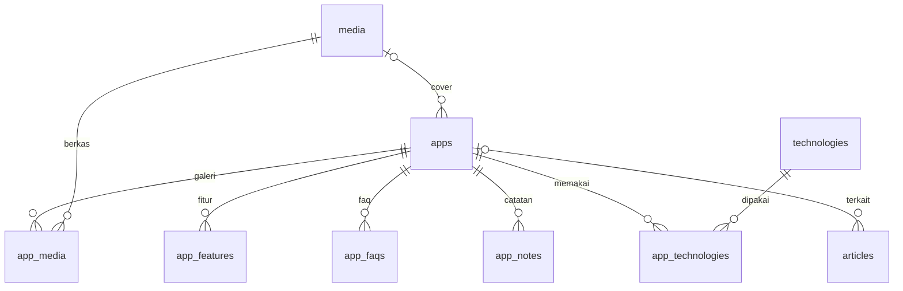

# 09 · Perombakan: WalDev sebagai Arsip Aplikasi

**Status:** Draf, menunggu persetujuan pemilik · **Tanggal:** 2026-09-12
**Hubungan dengan dokumen lain:** dokumen 01–08 menggambarkan arah lama (situs jasa studio). Bila ada yang bertentangan, dokumen ini yang berlaku. Dokumen lama tetap disimpan sebagai riwayat.

## 1. Ringkasan
WalDev berubah dari situs jasa studio menjadi **arsip aplikasi yang dibangun dan dirawat pemiliknya**. Tujuannya reputasi jangka panjang, bukan jualan atau mencari proyek. Karena itu tidak ada harga, WhatsApp, testimoni, atau formulir prospek. Setiap aplikasi punya halaman yang menjelaskannya secara lengkap, dan tulisan menempel ke aplikasinya. Kode yang ada **dirombak**, tidak ditulis ulang dari nol.

## 2. Keputusan dari sesi brainstorming
| Topik | Keputusan |
|---|---|
| Tujuan situs | Arsip & reputasi jangka panjang |
| Nama | Tetap **WalDev**; pemilik tampil sebagai pembuat (nama, foto, cerita singkat) di halaman Tentang |
| Halaman aplikasi | Halaman produk yang lengkap untuk calon pemakai, bukan studi kasus |
| Isi saat tayang | Tayang sambil membangun; situs WalDev sendiri jadi entri pertama |
| Status yang tampil | Sedang dibangun · Rilis · Pensiun. Yang berhenti sebelum rilis disembunyikan |
| Beranda | Daftar arsip, satu baris per aplikasi |
| Struktur halaman aplikasi | Bagian wajib + bagian opsional yang dinyalakan per aplikasi |
| Tulisan | Catatan pendek per aplikasi + artikel panjang sesekali; menu Artikel belum tampil |
| Tanggal | Tanggal catatan terakhir ditampilkan apa adanya |
| Modul jasa | Dihapus; kontak tersisa email & tautan sosial |
| Tampilan | Gaya Plain v3 dipertahankan |
| Domain | Domain baru bernama WalDev (dibeli pemilik) |
| Cara membangun | Rombak repo ini |

## 3. Ukuran keberhasilan
- Situs ini jadi tautan yang pemilik kirim setiap kali ditanya "sudah bikin apa saja?".
- Setiap aplikasi berstatus *Sedang dibangun* punya catatan dalam 30 hari terakhir (dipantau di Ringkasan panel, §7.2).
- Lighthouse ≥ 95 di keempat kategori tetap terjaga.

Jumlah pengunjung **bukan** ukuran keberhasilan.

## 4. Informasi arsitektur
### 4.1 Situs publik
| Rute | Isi | Perubahan |
|---|---|---|
| `/` | Daftar arsip | Dirombak total |
| `/apps/[slug]` | Halaman aplikasi | Baru, menggantikan `/portfolio/[slug]` |
| `/articles` · `/articles/[slug]` | Daftar & isi artikel | Tetap, tidak ada di menu bawaan |
| `/about` | Pembuat, cerita, kontak | Dirombak |
| `/privacy-policy` | Kebijakan privasi | Tetap, isinya disederhanakan (tidak ada lagi formulir) |
| 404 | Halaman tidak ditemukan | Tetap |

**Dihapus:** `/services`, `/services/[slug]`, `/portfolio`, `/portfolio/[slug]`, `/clients`, `/testimonials`, `/contact`, `/collaboration`, `/terms-of-service`.

**Pengalihan permanen (308)** di `next.config.ts`, supaya tautan lama tidak berakhir di 404:
- `/portfolio/:slug` → `/apps/:slug`
- `/contact`, `/collaboration` → `/about`
- `/portfolio`, `/services`, `/services/:slug`, `/clients`, `/testimonials`, `/terms-of-service` → `/`

**Menu bawaan:**
- Header: `Aplikasi` → `/` · `Tentang` → `/about`
- Footer: `Kebijakan Privasi`, email kontak, ikon sosial

Menu `Artikel` ditambahkan manual lewat Panel › Navigasi saat tulisannya dirasa cukup. Sengaja tidak ada logika otomatis: modul Navigasi sudah bisa melakukannya, dan ambang "cukup" lebih baik diputuskan pemilik.

### 4.2 Panel admin
| Menu | Perubahan |
|---|---|
| Ringkasan | Dirombak (§7.2) |
| Aplikasi | Baru, menggantikan Karya; termasuk catatan (§7.1) |
| Tulisan | Tetap + pilihan "Aplikasi terkait" |
| Media · Kategori · Tag | Tetap |
| Navigasi · Pengaturan · Pengguna · Peran · Aktivitas | Tetap; Pengaturan ditambah profil pembuat (§7.3) |

**Dihapus:** Layanan, Klien, Testimoni, Prospek, Pesan. Kelompok menu "Relasi" hilang.

## 5. Halaman publik
### 5.1 Beranda: daftar arsip
- Satu kalimat pengantar dari Pengaturan (`home_intro`).
- Satu baris per aplikasi yang tayang: **nama · satu kalimat · status · bulan-tahun catatan terakhir**.
- Urutan: catatan terakhir terbaru di atas; aplikasi berstatus *Pensiun* selalu di bawah.
- Tanpa gambar dan tanpa tombol ajakan. Tampil utuh walau baru satu aplikasi.
- Bila belum ada aplikasi tayang: satu kalimat jujur, misalnya "Aplikasi pertama sedang disiapkan."
- JSON-LD: `Organization` (WalDev) dengan `founder` → `Person`.

### 5.2 Halaman aplikasi `/apps/[slug]`
**Bagian wajib**, selalu tampil:
1. Nama, status, satu kalimat ringkasan, tanggal catatan terakhir.
2. Penjelasan lengkap (Tiptap).
3. Tangkapan layar utama + galeri. Video opsional berupa URL YouTube yang baru dimuat saat diklik, supaya tidak membebani Lighthouse.
4. Fitur utama (judul + penjelasan, berulang).
5. Tautan *Buka aplikasi* dan *Kode sumber* (masing-masing hanya bila diisi), serta teknologi yang dipakai.

**Bagian opsional**, dinyalakan per aplikasi dan hanya dirender bila isinya ada:
- Panduan pemakaian (Tiptap)
- FAQ (tanya-jawab, memakai `FaqAccordion` yang sudah ada)
- Catatan pembuatan (catatan pendek + artikel terkait, urut waktu)
- Catatan rilis (catatan yang punya nomor versi)

**Aplikasi berstatus *Pensiun*:** tombol *Buka aplikasi* disembunyikan otomatis, lalu tampil keterangan "Aplikasi ini tidak aktif lagi sejak {bulan tahun}. Halaman ini disimpan sebagai arsip." Tangkapan layar dan video jadi bukti utama, karena tautannya sudah mati.

SEO: JSON-LD `SoftwareApplication`; gambar OG = tangkapan layar utama.

### 5.3 Tentang `/about`
- Nama, foto, dan cerita singkat pembuat (Pengaturan, §7.3).
- Fakta WalDev yang sudah ada: kota, provinsi, tahun berdiri.
- Kontak: email + tautan sosial. Tanpa formulir, tanpa WhatsApp.
- JSON-LD: `Person` + `Organization`.
- Dihapus: prinsip kerja, `ProcessTimeline`, panel ajakan.

### 5.4 Artikel
- Tetap, ditambah kolom opsional *Aplikasi terkait*.
- Artikel terkait tampil di bagian Catatan pembuatan aplikasinya, dan halaman artikel menautkan balik ke aplikasi itu.
- Panel ajakan WhatsApp di akhir artikel dihapus.

## 6. Model data
Konvensi mengikuti [05 · Database](./05-database-erd.md): PK CUID2, timestamp epoch, boolean 0/1, enum `text` + Zod.

### 6.1 Tabel baru
- **apps**: id · name · slug(UNIQUE) · tagline · description_json · description_html · status(building|released|retired) · is_published(bool, default 0) · app_url · repo_url · video_url · cover_media_id FK→media(SET NULL) · started_at · released_at · retired_at · guide_json · guide_html · show_guide · show_faq · show_notes · show_releases (bool) · timestamps
  - Index: status, is_published
- **app_media** (galeri): id · app_id FK(CASCADE) · media_id FK(CASCADE) · caption · order
- **app_features**: id · app_id FK(CASCADE) · title · description · order
- **app_technologies**: app_id FK · technology_id FK · **PK(app_id, technology_id)**
- **app_faqs**: id · app_id FK(CASCADE) · question · answer · order
- **app_notes**: id · app_id FK(CASCADE) · body (teks biasa, beberapa kalimat) · version (nullable; terisi = catatan rilis) · noted_at (default sekarang, bisa diubah) · timestamps
  - Index: (app_id, noted_at)
  - `noted_at` terpisah dari `created_at` supaya catatan aplikasi lama bisa diberi tanggal mundur saat diarsipkan.
  - Tanpa draf: simpan = tayang (alasan di §7.1).

`is_published = 0` dipakai untuk draf maupun aplikasi yang berhenti sebelum rilis.

### 6.2 Kolom yang berubah
- **articles**: + `app_id` FK→apps(SET NULL), nullable, di-index.
- **categories.type**: `article|portfolio|client` → `article`. Enum `text` di SQLite hanya dicek di TypeScript/Zod, jadi tidak butuh migrasi.
- **seo_meta.entity_type**: `article|app|page` (sama, hanya di tingkat kode).
- **settings**: + `home_intro`, `owner_name`, `owner_photo_media_id`, `owner_bio`; − `contact_whatsapp`; isi `tagline` & `description` diganti (bukan lagi "Studio Digital Indonesia").

### 6.3 Tanggal catatan terakhir
`last_activity_at` dihitung saat query, tidak disimpan: MAX dari `app_notes.noted_at` dan `articles.published_at` (artikel terkait yang berstatus published). Jumlah aplikasi kecil, jadi subquery tidak jadi masalah.
- Bila belum ada catatan sama sekali, halaman menampilkan "Belum ada catatan", dan pengurutan memakai `created_at`.

### 6.4 Tabel yang dihapus
services · service_features · service_workflow_steps · service_faqs · clients · testimonials · collaboration_requests · contact_messages · portfolios · portfolio_media · portfolio_features · portfolio_technologies

### 6.5 RBAC
- **Dihapus:** `service.*`, `portfolio.*`, `testimonial.manage`, `client.manage`, `lead.read`, `lead.update`, serta peran `sales` (0 pengguna di produksi per 2026-09-12).
- **Ditambah:** `app.create`, `app.update`, `app.delete`. Mengelola catatan cukup dengan `app.update`.
- Peran `owner` & `editor` tetap. `editor` mendapat `app.*` sebagai pengganti `portfolio.*`.

### 6.6 ERD domain baru

## 7. Panel admin
### 7.1 Aplikasi
- **Daftar:** nama · status · tayang/tersembunyi · catatan terakhir.
- **Form sunting**, dikelompokkan: Dasar (nama, slug, satu kalimat, status, tayang, tanggal mulai/rilis/pensiun, tautan) · Penjelasan & fitur · Media (tangkapan layar utama, galeri, URL video, teknologi) · Bagian opsional (saklar + isi panduan & FAQ) · SEO.
- **Catatan:** kotak *Tulis catatan* di paling atas halaman sunting berisi teks, versi (opsional), dan tanggal. Satu klik simpan langsung tayang, tanpa draf. Asumsi paling berisiko proyek ini adalah pemilik rutin menulis catatan, jadi menulisnya harus secepat mengetik pesan.

### 7.2 Ringkasan
- Tombol cepat: *Tulis catatan* (pilih aplikasi) · *Aplikasi baru* · *Tulisan baru*.
- Panel **Perlu kabar**: aplikasi berstatus *Sedang dibangun* yang tidak punya catatan lebih dari 30 hari.
- Daftar kelengkapan: email kontak · tautan sosial · profil pembuat (nama, foto, cerita) · kalimat pengantar beranda · alamat situs bukan lagi `workers.dev`.
- Dihapus: angka & antrean prospek/pesan, cek WhatsApp, cek testimoni.

### 7.3 Pengaturan
Ditambah *Profil pembuat* (nama, foto lewat media picker, cerita singkat) dan *Kalimat pengantar beranda*. Isian WhatsApp dihapus.

## 8. Dampak ke kode
### 8.1 Dihapus
| Area | Berkas |
|---|---|
| Modul | `src/modules/{services,clients,testimonials,leads,portfolio}/` (portfolio diganti `src/modules/apps/`) |
| Halaman publik | `src/app/(public)/{services,portfolio,clients,testimonials,contact,collaboration,terms-of-service}/` |
| Halaman panel | `src/app/(admin)/panel/(dashboard)/{services,portfolio,clients,testimonials,collaboration,contact-messages}/` |
| API | `src/app/api/collaboration/attachment/` |
| Komponen | `components/home/*`, `cta-panel`, `process-timeline`, `project-card`, `rating-bars`, `service-icon`; kandidat: `turnstile-widget` |
| Lib & server | `lib/whatsapp.ts`, `lib/harga.ts`, `server/turnstile.ts`, `server/notify.ts`, `server/rate-limit.ts` |
| Konstanta | `HERO_TITLE`, `DURASI`, `WAKTU_BALAS`; data `HOME_FAQS`/`GENERAL_FAQS` (komponen `FaqAccordion` tetap) |

Setelah menghapus, jalankan `pnpm typecheck` dan `pnpm lint` untuk menemukan sisa impor.

### 8.2 Diubah
- **Publik:** `(public)/page.tsx`, `(public)/about/page.tsx`, `(public)/layout.tsx` (menu bawaan, footer tanpa WhatsApp), `(public)/articles/[slug]/page.tsx`, `sitemap.ts`
- **Panel:** `panel/(dashboard)/page.tsx`, `panel/(dashboard)/layout.tsx` (hitungan prospek dihapus), `components/admin/admin-nav.tsx`, form & DAL artikel (aplikasi terkait)
- **Inti:** `server/db/schema.ts`, `server/rbac/permissions.ts`, `app/api/seed/route.ts`, `modules/settings/settings.ts`, `lib/constants.ts`, `lib/status.ts`, `next.config.ts` (pengalihan)
- **Skrip & dokumen:** `scripts/seed-dummy-lokal.mjs`, `scripts/gen-og.mjs` (masih bertuliskan wolue.cloud), `README.md`, deskripsi di `package.json`, `docs/README.md`
- **Domain** (§10): `wrangler.jsonc`, `server/auth/config.ts`, `workers/cron-scheduler/wrangler.jsonc`

## 9. Data produksi & migrasi
### 9.1 Kondisi D1 produksi (dibaca 2026-09-12)
| Tabel | Baris | Catatan |
|---|---|---|
| portfolios | 4 | 2 data contoh dari seed ("Company Profile Modern", "Dashboard Internal Tim"). **iaUndang** & **SIM-KGB** dimasukkan manual belakangan, masing-masing punya cover dan 4 fitur, kemungkinan aplikasi nyata |
| articles | 3 | Artikel contoh bertema jasa studio |
| services · testimonials · clients | 6 · 3 · 3 | Data contoh |
| collaboration_requests · contact_messages | 0 · 0 | Tidak ada prospek atau pesan nyata |
| media | 4 | Berkas R2 tidak ikut dihapus |
| pengguna ber-peran `sales` | 0 | Peran aman dihapus |

### 9.2 Urutan migrasi
Urutannya penting: kode lama yang masih tayang akan error 500 bila tabelnya dihapus lebih dulu.
1. **Cadangan:** `npx wrangler d1 export waldev-db --remote --output <berkas>.sql`. Berkas cadangan tidak di-commit.
2. **Migrasi A (menambah):** tabel `apps` beserta anak-anaknya + `articles.app_id` → `pnpm db:generate` → terapkan lokal → uji.
3. **Salin data** (bila disetujui, §13): iaUndang & SIM-KGB dari `portfolios`/`portfolio_features` ke `apps`/`app_features` lewat `INSERT … SELECT`.
4. **Terapkan migrasi A ke remote**, lalu deploy kode baru lewat `wrangler versions upload` → uji URL pratinjau → `versions deploy`.
5. **Migrasi B (menghapus):** drop tabel §6.4 + hapus permission & peran lama, dibuat sebagai generate terpisah. Dijalankan ke remote hanya setelah kode baru terbukti jalan, dan dengan persetujuan eksplisit pemilik saat itu karena tidak bisa dibatalkan.

Migrasi A dan B sengaja dipisah. `drizzle-kit generate` bisa bertanya secara interaktif apakah tabel baru hasil rename tabel lama bila penambahan dan penghapusan tabel ada dalam satu diff. Dengan dipisah, pertanyaan itu tidak muncul, dan ada titik aman untuk menyalin data.

## 10. Domain
- Pemilik membeli domain bernama WalDev; ketersediaan dan harganya dicek pemilik sendiri.
- Setelah aktif: pasang Custom Domain pada Worker `waldev`, ubah `NEXT_PUBLIC_SITE_URL`, ganti `trustedOrigins` (hapus wolue.cloud), ubah `CRON_TARGET`, set `BETTER_AUTH_URL`, dan buat ulang gambar OG.
- Perombakan tidak menunggu domain. Sampai domain siap, situs tetap di `workers.dev`.

## 11. Urutan kerja
| Fase | Isi | Selesai bila |
|---|---|---|
| 1 · Fondasi data | Skema + migrasi A, modul `src/modules/apps` (Zod, DAL, actions), RBAC `app.*` | typecheck lolos, migrasi lokal jalan |
| 2 · Panel | Aplikasi (daftar, form, catatan cepat), Tulisan + aplikasi terkait, Pengaturan profil, Ringkasan, menu admin | Satu aplikasi lengkap bisa diisi dari panel |
| 3 · Situs publik | Beranda, `/apps/[slug]`, Tentang, artikel, layout & menu, sitemap, pengalihan, JSON-LD | Semua rute §4.1 membalas 200 |
| 4 · Pembersihan | Hapus kode §8.1, migrasi B lokal, perbarui seed/skrip/README/docs | typecheck + lint + build bersih |
| 5 · Tayang | Isi entri WalDev + catatan pertama, deploy lewat pratinjau, migrasi B remote, Lighthouse ≥ 95, domain bila siap | Produksi tayang tanpa sisa modul jasa |

Setiap fase ditutup dengan `pnpm typecheck`, `pnpm lint`, `pnpm build` (webpack, jangan Turbopack), lalu commit. `pnpm cf:build` wajib sebelum deploy.

## 12. Asumsi yang diuji
1. **Pemilik rutin menulis catatan pendek.** Diuji dua minggu di luar situs sebelum tayang; setelah tayang dipantau lewat panel *Perlu kabar*.
2. **Satu struktur dasar cukup untuk semua aplikasi.** Dinilai saat aplikasi kedua dimasukkan; bagian opsional jadi jalan keluar.
3. **Arsip tetap berguna walau pengunjungnya sedikit.** Diukur dari dipakai atau tidaknya tautan situs sebagai jawaban (§3).

## 13. Keputusan terbuka
**Sudah diputuskan (2026-09-12):**
- iaUndang dan SIM-KGB **dipindahkan** ke arsip (langkah 3 di §9.2). Status dan penjelasan lengkapnya diisi pemilik lewat panel.
- 3 artikel contoh di produksi **dihapus**, dijalankan bersama migrasi B, dan tetap tersimpan di berkas cadangan.

**Masih terbuka:**
- Kalimat pengantar beranda dan tagline baru.
- Nama domain.

## 14. Di luar cakupan
Harga, WhatsApp, testimoni, formulir prospek/kontak, beranda berbentuk linimasa, susunan blok bebas, kategori aplikasi, multi-bahasa, komentar, statistik pengunjung.
