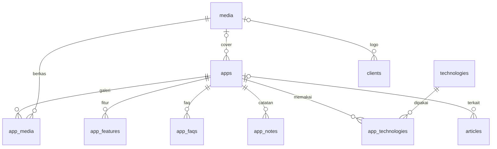

# 09 · Perombakan: WalDev sebagai Arsip Aplikasi

**Status:** Disetujui pemilik 2026-09-12 · Tahap 1–4 selesai, Tahap 5 (tayang) berjalan · Revisi beranda & klien 2026-09-12, revisi hero, logo, dan kartu 2026-09-13, revisi nada software house 2026-09-13 sore (§15)
**Hubungan dengan dokumen lain:** dokumen 01–08 menggambarkan arah lama (situs jasa studio). Bila ada yang bertentangan, dokumen ini yang berlaku. Dokumen lama tetap disimpan sebagai riwayat.

## 1. Ringkasan
WalDev berubah dari situs jasa studio menjadi **portofolio proyek bernada software house**: WalDev tampil sebagai pihak yang mengerjakan proyek, dan pengunjung datang untuk melihat hasil kerjanya serta mengunjungi situs proyek yang masih tayang. Tujuannya reputasi jangka panjang, bukan jualan, jadi tidak ada harga, WhatsApp, testimoni, atau formulir prospek. Logo klien yang pernah bekerja sama tetap tampil di beranda sebagai bukti kerja. Setiap proyek punya halaman yang menjelaskannya secara lengkap, dan tulisan menempel ke proyeknya. Kode yang ada **dirombak**, tidak ditulis ulang dari nol.

## 2. Keputusan
| Topik | Keputusan |
|---|---|
| Tujuan situs | Arsip & reputasi jangka panjang |
| Nama | Tetap **WalDev**; pemilik tampil sebagai pembuat (nama, foto, cerita singkat) di halaman Tentang |
| Suara tulisan | Bernada software house dengan acuan gaya vodjo.com/id dan gosocial.co.id: "kami" untuk WalDev dan "Anda" untuk pengunjung, tanpa kata "saya". Pengunjung diajak melihat portofolio dan mengunjungi situs proyek yang masih tayang, bukan mencoba aplikasi. Menu dan bagian memakai *Portofolio*, itemnya *proyek*; panel tetap *aplikasi* |
| Tagline | Build Digital Products |
| Halaman proyek | Halaman portofolio yang lengkap (penjelasan, fitur, tangkapan layar, tautan ke situs bila masih tayang), bukan studi kasus |
| Isi saat tayang | Tayang sambil membangun; situs WalDev sendiri jadi entri pertama |
| Status yang tampil | Sedang dibangun · Sudah rilis · Tidak aktif. Yang berhenti sebelum rilis disembunyikan |
| Beranda | Hero Cetak biru (judul "Software house untuk solusi digital Anda.", dua ajakan, gambar dari Pengaturan atau proyek terbaru) · logo klien yang muncul bertahap · Portofolio (kartu unggulan + grid) · tulisan terbaru · ajakan kontak lewat email |
| Struktur halaman aplikasi | Bagian wajib + bagian opsional yang dinyalakan per aplikasi |
| Tulisan | Catatan pendek per aplikasi + artikel panjang sesekali; 3 tulisan terbaru tampil di beranda; menu Artikel belum tampil |
| Tanggal | Tanggal catatan terakhir ditampilkan apa adanya |
| Modul jasa | Dihapus, kecuali Klien yang dipulihkan untuk logo di beranda; kontak tersisa email & tautan sosial |
| Logo klien | Hanya klien sungguhan. Logo contoh tidak ditampilkan di situs publik |
| Halaman publik | Berkas statis hasil `pnpm terbitkan` karena paket Workers Free ([10 · Rencana Tayang](./10-rencana-tayang.md) §5) |
| Tampilan | Gaya Plain v3 dipertahankan; token teks pudar tema terang digelapkan ke `#737373` (4,7:1) supaya lolos WCAG AA |
| Domain | Domain baru bernama WalDev (dibeli pemilik) |
| Cara membangun | Rombak repo ini |

## 3. Ukuran keberhasilan
- Situs ini jadi tautan yang pemilik kirim setiap kali ditanya "sudah bikin apa saja?".
- Setiap aplikasi berstatus *Sedang dibangun* punya catatan dalam 30 hari terakhir (dipantau di Ringkasan panel, §7.2).
- Lighthouse ≥ 95 di keempat kategori tetap terjaga.

Jumlah pengunjung **bukan** ukuran keberhasilan.

## 4. Informasi arsitektur
### 4.1 Situs publik
| Rute | Isi | Perubahan |
|---|---|---|
| `/` | Hero, logo klien, portofolio, tulisan terbaru, ajakan kontak | Dirombak total, direvisi (§5.1) |
| `/apps` | Semua proyek dengan saringan status | Baru 2026-09-13 (§5.1) |
| `/apps/[slug]` | Halaman proyek | Baru, menggantikan `/portfolio/[slug]` |
| `/articles` · `/articles/[slug]` | Daftar & isi artikel | Tetap, tidak ada di menu bawaan |
| `/about` | Pembuat, cerita, kontak | Dirombak |
| `/privacy-policy` | Kebijakan privasi | Tetap, isinya disederhanakan (tidak ada lagi formulir) |
| 404 | Halaman tidak ditemukan | Tetap |

**Dihapus:** `/services`, `/services/[slug]`, `/portfolio`, `/portfolio/[slug]`, `/clients`, `/testimonials`, `/contact`, `/collaboration`, `/terms-of-service`. Logo klien hanya tampil di beranda, tanpa halaman sendiri.

**Pengalihan permanen (308)** di `next.config.ts`, supaya tautan lama tidak berakhir di 404:
- `/portfolio/:slug` → `/apps/:slug`
- `/contact`, `/collaboration` → `/about`
- `/portfolio`, `/services`, `/services/:slug`, `/clients`, `/testimonials`, `/terms-of-service` → `/`

**Menu bawaan:**
- Header: `Portofolio` → `/apps` · `Tentang` → `/about`. *Portofolio* juga menyala di halaman setiap proyek
- Footer: `Kebijakan Privasi`, email kontak, ikon sosial

Menu `Artikel` ditambahkan manual lewat Panel › Navigasi saat tulisannya dirasa cukup. Sengaja tidak ada logika otomatis: modul Navigasi sudah bisa melakukannya, dan ambang "cukup" lebih baik diputuskan pemilik.

### 4.2 Panel admin
| Menu | Perubahan |
|---|---|
| Ringkasan | Dirombak (§7.2) |
| Aplikasi | Baru, menggantikan Karya; termasuk catatan (§7.1) |
| Tulisan | Tetap + pilihan "Aplikasi terkait" |
| Klien | Dipulihkan di kelompok Konten (§7.4) |
| Media · Kategori · Tag | Tetap |
| Navigasi · Pengaturan · Pengguna · Peran · Aktivitas | Tetap; Pengaturan ditambah profil pembuat dan hero beranda (§7.3) |

**Dihapus:** Layanan, Testimoni, Prospek, Pesan. Kelompok menu "Relasi" hilang.

## 5. Halaman publik
### 5.1 Beranda
Urutan bagian dari atas:
1. **Hero.** Judul dari Pengaturan (`home_intro`; selama kosong dipakai `HOME_INTRO` di `src/lib/constants.ts`: "Software house untuk solusi digital Anda."), kalimat pengantar `HOME_LEAD` ("WalDev membangun aplikasi web dan sistem informasi. Setiap proyek di portofolio punya halaman sendiri, dan yang masih tayang bisa langsung dikunjungi."), tombol *Lihat portofolio* ke `#portofolio`, dan tautan *Hubungi WalDev* ke email kontak (hanya bila email kontak diisi). Di bawahnya gambar hero yang dirakit sebagai kartu 3D di atas lantai Cetak biru (§16):
   - Gambarnya `hero_media_id` bila diisi di Pengaturan, selain itu tangkapan layar utama proyek di hero.
   - Proyek di hero adalah `hero_app_slug` bila dipilih (keterangan "Proyek unggulan · {nama}"), selain itu proyek teratas yang punya tangkapan layar dan tidak berstatus *Tidak aktif* (keterangan "Proyek terbaru · {nama}"). Gambar menaut ke halaman proyek itu.
   - Bila tidak ada gambar yang bisa dipakai, hero berhenti di tombol.
2. **Logo klien.** Satu baris logo dari modul Klien (§7.4) berlabel "Pernah bekerja sama dengan kami". Klien NDA tidak ikut, klien tanpa logo tampil sebagai nama, dan logo menaut ke situs web klien bila diisi. Logo muncul satu per satu dari buram ke tajam saat deretannya masuk layar; animasi dilewati bila deretan sudah terlihat ketika halaman siap, tanpa JavaScript, atau saat gerak dikurangi. Hanya klien sungguhan yang ditampilkan. Bagian ini hilang bila kosong.
3. **Portofolio** (`#portofolio`, berjudul *Portofolio* tanpa deskripsi karena pengantar hero sudah menjelaskan isi halaman proyek). Satu kartu per proyek yang tayang: tangkapan layar utama, logo yang menumpang di tepi bawah tangkapan layar (selama logo belum diunggah, monogram dua huruf dari nama, misalnya "IU" untuk iaUndang), nama, satu kalimat, status, bulan-tahun catatan terakhir, dan pada kartu lebar tautan *Lihat proyek*. Susunan *Unggulan + grid*:
   - Kartu teratas selalu lebar.
   - Beranda memuat paling banyak tujuh kartu: satu kartu lebar dan enam kartu grid. Satu kartu grid tampil lebar; dua atau empat memakai dua kolom; selebihnya sampai tiga kolom di layar lebar.
   - Bila proyeknya lebih dari tujuh, muncul tautan *Lihat semua {jumlah} proyek* ke `/apps`.
   - Urutan: catatan terakhir terbaru di atas; proyek berstatus *Tidak aktif* selalu di bawah dan gambarnya abu-abu.
   - Bila belum ada proyek tayang: "Proyek pertama masih dalam pengerjaan."
4. **Tulisan terbaru.** 3 tulisan terbit terbaru dengan kartu yang sama seperti `/articles`, ditambah tautan *Semua tulisan*. Bagian ini hilang bila belum ada tulisan terbit.
5. **Ajakan kontak** (`#kontak`). Judul "Punya proyek yang ingin dibicarakan?", satu kalimat ajakan, tombol *Hubungi kami* yang membuka email, dan alamat email kontak. Pola penutup ini diambil dari situs acuan; formulir konsultasi dan WhatsApp sengaja tidak ada. Bagian ini hanya tampil bila email kontak diisi di Pengaturan.

**Halaman `/apps`.** Berjudul *Semua proyek* dengan eyebrow *Portofolio*: semua proyek yang tayang dalam grid tiga kolom (dua di tablet, satu di ponsel), dengan tombol saring *Semua*, *Sedang dibangun*, *Sudah rilis*, dan *Tidak aktif* beserta jumlahnya. Tombol tanpa kartu tidak tampil. Kartu dirender di server dan penyaringannya hanya mengganti atribut `data-filter`, jadi halamannya tetap berkas statis. Bila baru ada satu proyek, halamannya berisi satu kartu lebar tanpa tombol saring.

Teks memakai sudut pandang "kami" dan "Anda" tanpa kata "saya", dan tidak ada angka, testimoni, atau klaim yang tidak berasal dari data. JSON-LD `Organization` (WalDev) dengan `founder` → `Person` dipasang di layout publik.

### 5.2 Halaman proyek `/apps/[slug]`
**Bagian wajib**, selalu tampil:
1. Nama, status, satu kalimat ringkasan, tanggal catatan terakhir.
2. Penjelasan lengkap (Tiptap).
3. Tangkapan layar utama + galeri. Video opsional berupa URL YouTube yang baru dimuat saat diklik, supaya tidak membebani Lighthouse.
4. Fitur utama (judul + penjelasan, berulang).
5. Tautan *Kunjungi situs* (membuka situs proyek yang tayang) dan *Lihat kode sumber* (masing-masing hanya bila diisi), serta teknologi yang dipakai. Tautan kembali di atas judul, *Semua proyek*, menuju `/apps`.

**Bagian opsional**, dinyalakan per aplikasi dan hanya dirender bila isinya ada:
- Cara pakai (Tiptap)
- FAQ (tanya-jawab, memakai `FaqAccordion`)
- Catatan pembuatan (catatan pendek + artikel terkait, urut waktu)
- Catatan rilis (catatan yang punya nomor versi)

**Susunan *Kepala terbelah* (2026-09-13).** Di layar lebar kepala halaman dua kolom. Kiri: tautan kembali, logo atau monogram, status, nama, satu kalimat, tombol *Kunjungi situs* dan *Lihat kode sumber*. Kanan: tangkapan layar utama dalam bingkai bermotif Cetak biru. Tanpa tangkapan layar, kepala kembali satu kolom. Di bawahnya ringkasan fakta (status, mulai dibangun, dirilis, tidak aktif sejak, teknologi, situs, catatan terakhir), masing-masing hanya tampil bila datanya ada. Lalu penjelasan dalam kolom baca, bagian dengan judul di kiri dan isi di kanan (fitur utama bernomor, cara pakai, FAQ, catatan rilis, catatan pembuatan), galeri, *Proyek lain* (hingga tiga, hanya bila ada proyek lain yang tayang), dan ajakan kontak *Punya proyek serupa?* bila email kontak diisi.

**Proyek berstatus *Tidak aktif*:** tombol *Kunjungi situs* disembunyikan otomatis, lalu tampil keterangan "Proyek ini sudah tidak aktif sejak {bulan tahun}. Halaman ini tetap ada sebagai dokumentasi." Tangkapan layar dan video jadi bukti utama, karena tautannya sudah mati.

SEO: JSON-LD `SoftwareApplication`; gambar OG = tangkapan layar utama.

### 5.3 Tentang `/about`
- Nama, foto, dan cerita singkat pembuat (Pengaturan, §7.3). Selama cerita kosong, tampil kalimat bawaan yang memperkenalkan WalDev sebagai software house yang membangun aplikasi web dan sistem informasi.
- Fakta WalDev: kota, provinsi, tahun berdiri, jumlah proyek.
- Kontak: email + tautan sosial. Tanpa formulir, tanpa WhatsApp.
- JSON-LD: `ProfilePage` dengan `Person` + `Organization`.

### 5.4 Artikel
- Tetap, ditambah kolom opsional *Aplikasi terkait*.
- Artikel terkait tampil di bagian Catatan pembuatan aplikasinya, dan halaman artikel menautkan balik ke aplikasi itu.
- Panel ajakan WhatsApp di akhir artikel dihapus.
- Kartu tulisan dipakai bersama oleh `/articles` dan beranda (`src/modules/articles/components/article-card.tsx`).

## 6. Model data
Konvensi mengikuti [05 · Database](./05-database-erd.md): PK CUID2, timestamp epoch, boolean 0/1, enum `text` + Zod.

### 6.1 Tabel baru
- **apps**: id · name · slug(UNIQUE) · tagline · description_json · description_html · status(building|released|retired) · is_published(bool, default 0) · app_url · repo_url · video_url · cover_media_id FK→media(SET NULL) · logo_media_id FK→media(SET NULL, migrasi 0005) · started_at · released_at · retired_at · guide_json · guide_html · show_guide · show_faq · show_notes (default 1) · show_releases (bool) · timestamps
  - Index: status, is_published
- **app_media** (galeri): id · app_id FK(CASCADE) · media_id FK(CASCADE) · caption · order
- **app_features**: id · app_id FK(CASCADE) · title · description · order
- **app_technologies**: app_id FK · technology_id FK · **PK(app_id, technology_id)**
- **app_faqs**: id · app_id FK(CASCADE) · question · answer · order
- **app_notes**: id · app_id FK(CASCADE) · body (teks biasa, beberapa kalimat) · version (nullable; terisi = catatan rilis) · noted_at (default sekarang, bisa diubah) · timestamps
  - Index: (app_id, noted_at)
  - `noted_at` terpisah dari `created_at` supaya catatan aplikasi lama bisa diberi tanggal mundur.
  - Tanpa draf: simpan = tayang (alasan di §7.1).

`is_published = 0` dipakai untuk draf maupun aplikasi yang berhenti sebelum rilis. Tanggal dari isian tanggal disimpan pukul 12.00 UTC supaya tidak bergeser hari di zona waktu Indonesia.

### 6.2 Kolom yang berubah
- **articles**: + `app_id` FK→apps(SET NULL), nullable, di-index.
- **categories.type**: `article|portfolio|client` → `article`. Enum `text` di SQLite hanya dicek di TypeScript/Zod.
- **seo_meta.entity_type**: `article|app|page` (tingkat kode).
- **settings**: + `home_intro`, `hero_media_id` (id media gambar hero), `hero_app_slug` (slug aplikasi di hero), `owner_name`, `owner_photo_media_id`, `owner_bio`; − `contact_whatsapp`; isi `tagline` & `description` mengikuti `SITE` di `src/lib/constants.ts`. Tabel `settings` berupa kunci dan nilai, jadi kunci baru tidak butuh migrasi.

### 6.3 Tanggal catatan terakhir
`last_activity_at` dihitung saat query, tidak disimpan: MAX dari `app_notes.noted_at` dan `articles.published_at` (artikel terkait yang berstatus published). Jumlah aplikasi kecil, jadi subquery tidak jadi masalah.
- Bila belum ada catatan sama sekali, halaman menampilkan "Belum ada catatan", dan pengurutan memakai `created_at`.
- Rujukan ke baris luar di subquery ditulis literal `"apps"."id"`: pada query satu tabel Drizzle menulis kolom tanpa nama tabel, sehingga `"id"` terbaca sebagai kolom tabel subquery.

### 6.4 Tabel yang dihapus
services · service_features · service_workflow_steps · service_faqs · testimonials · collaboration_requests · contact_messages · portfolios · portfolio_media · portfolio_features · portfolio_technologies

### 6.5 Tabel yang dipulihkan
- **clients**: id · name · slug(UNIQUE) · logo_media_id FK→media(SET NULL) · category_id FK→categories(SET NULL) · website_url · is_nda(bool) · order · timestamps
  - Definisinya sama persis dengan `0000_calm_bastion`, supaya tabel yang masih ada di produksi langsung cocok dengan kode.
  - `category_id` dipertahankan di tabel tetapi tidak dipakai kode lagi (kategori hanya untuk tulisan, §6.2).

### 6.6 RBAC
- **Dihapus:** `service.*`, `portfolio.*`, `testimonial.manage`, `lead.read`, `lead.update`, serta peran `sales` (0 pengguna di produksi per 2026-09-12).
- **Ditambah:** `app.create`, `app.update`, `app.delete`. Mengelola catatan cukup dengan `app.update`.
- **Dipertahankan:** `client.manage`, untuk peran `owner` dan `editor`.
- Peran `owner` & `editor` tetap. Guard dan halaman Peran membaca daftar izin dari kode (`permissions.ts`), jadi izin baru tidak butuh baris di tabel `permissions`.

### 6.7 ERD domain baru

## 7. Panel admin
### 7.1 Aplikasi
- **Daftar:** nama · status · tayang/tersembunyi · catatan terakhir.
- **Form sunting**, dikelompokkan: Dasar (nama, satu kalimat) · Penjelasan & fitur · Media (logo aplikasi, tangkapan layar utama, galeri, URL video) · Bagian opsional (saklar + isi panduan & FAQ) · samping: status, tayang, slug, tanggal mulai/rilis/pensiun, tautan, teknologi, SEO.
- **Catatan:** kotak *Tulis catatan* di paling atas halaman sunting berisi teks, versi (opsional), dan tanggal. Satu klik atau Ctrl/⌘+Enter langsung tayang, tanpa draf. Asumsi paling berisiko proyek ini adalah pemilik rutin menulis catatan, jadi menulisnya harus secepat mengetik pesan.

### 7.2 Ringkasan
- Tombol cepat: *Aplikasi* · *Tulisan* · *Lihat situs*, dan kotak *Tulis catatan* dengan pilihan aplikasi.
- Panel **Perlu kabar**: aplikasi berstatus *Sedang dibangun* yang tidak punya catatan lebih dari 30 hari. Jumlahnya juga tampil sebagai lencana di menu Aplikasi.
- Daftar kelengkapan: email kontak · tautan sosial · profil pembuat (nama, foto, cerita) · judul hero beranda · alamat situs bukan lagi `workers.dev`.

### 7.3 Pengaturan
Isian dikelompokkan: Identitas situs · *Hero beranda* (judul hero, gambar hero lewat media picker, dan pilihan aplikasi di hero dari daftar aplikasi yang tayang) · *Profil pembuat* (nama, foto lewat media picker, cerita singkat) · Kontak & sosial · Lokasi. Semua isian media memakai media picker yang sama; nilainya id media.

### 7.4 Klien
Satu halaman berizin `client.manage`: formulir (logo lewat media picker, nama, situs web, NDA, urutan) dan daftar klien dengan tombol sunting & hapus. Tanpa kategori. Logo sebaiknya berlatar transparan dan berwarna gelap, karena di beranda logo dipudarkan dan warnanya dibalik pada tema gelap. Seperti konten lain, perubahan baru tampil di situs setelah halaman diterbitkan ulang.

## 8. Dampak ke kode
### 8.1 Dihapus (Tahap 4)
| Area | Berkas |
|---|---|
| Modul | `src/modules/{services,testimonials,leads,portfolio}/` (portfolio diganti `src/modules/apps/`) |
| Halaman publik | `src/app/(public)/{services,portfolio,clients,testimonials,contact,collaboration,terms-of-service}/` |
| Halaman panel | `src/app/(admin)/panel/(dashboard)/{services,portfolio,testimonials,collaboration,contact-messages}/` |
| API | `src/app/api/collaboration/attachment/` |
| Komponen | `components/home/*` (kecuali yang dibuat ulang di §8.3), `cta-panel`, `process-timeline`, `project-card`, `rating-bars`, `service-icon`, `turnstile-widget`, `ui/point-list` |
| Lib & server | `lib/whatsapp.ts`, `lib/harga.ts`, `server/turnstile.ts`, `server/notify.ts`, `server/rate-limit.ts` |
| Konstanta | `HERO_TITLE`, `DURASI`, `WAKTU_BALAS`; data `HOME_FAQS`/`GENERAL_FAQS` (komponen `FaqAccordion` tetap) |
| Env | `TURNSTILE_*`, `RESEND_API_KEY`, `LEAD_*` dari `.dev.vars.example` |

### 8.2 Diubah
- **Publik:** beranda, Tentang, layout publik, artikel, kebijakan privasi, 404, `sitemap.ts`, `next.config.ts` (pengalihan)
- **Panel:** Ringkasan, layout dashboard, menu admin, form & DAL artikel, Pengaturan, Kategori
- **Inti:** `server/db/schema.ts`, `server/rbac/permissions.ts`, `app/api/seed/route.ts`, `modules/settings/settings.ts`, `lib/constants.ts`, `lib/status.ts`
- **Skrip & dokumen:** `scripts/seed-dummy-lokal.mjs` (contoh arsip aplikasi), `scripts/gen-og.mjs` + `public/og.png` (gaya Plain), `README.md`, `package.json`, `docs/README.md`
- **Domain** (§10): `wrangler.jsonc`, `server/auth/config.ts`, `workers/cron-scheduler/wrangler.jsonc`, `scripts/gen-og.mjs`

### 8.3 Revisi beranda & klien
- **Dipulihkan dari riwayat git** (tanpa kategori): `src/modules/clients/{client.schema,client.dal,client.actions}.ts`, `src/modules/clients/components/client-manager.tsx`, `src/app/(admin)/panel/(dashboard)/clients/page.tsx`, tabel `clients` di `schema.ts`, izin `client.manage`, menu Klien.
- **Dibuat ulang:** `src/components/home/hero.tsx`, `src/components/home/client-logos.tsx`.
- **Baru:** `src/modules/articles/components/article-card.tsx` (kartu bersama), kolom `coverUrl` di `listPublishedApps`.
- **Diubah:** beranda, `/articles`, `HOME_LEAD`, migrasi `0003`, migrasi baru `0004_pulihkan_klien`.

### 8.4 Revisi hero, logo, dan kartu (2026-09-13)
- **Baru:** `src/app/(public)/apps/page.tsx` (halaman Semua aplikasi), `src/modules/apps/components/app-status-filter.tsx` (tombol saring), kunci pengaturan `hero_media_id` & `hero_app_slug`.
- **Ditulis ulang:** `src/components/home/rakit-scene.ts` (lantai Cetak biru, transisi baru), `src/components/home/hero-rakit.tsx` (pudar masuk tanpa kedipan, jeda saat tidak terlihat), `src/components/home/hero.tsx` (gambar dari Pengaturan), `src/components/home/client-logos.tsx` (komponen klien dengan animasi muncul), beranda.
- **Diubah:** `src/modules/apps/components/app-card.tsx` (gambar abu-abu untuk aplikasi tidak aktif), `src/modules/settings/{settings.ts,components/settings-form.tsx}`, halaman Pengaturan panel, Ringkasan panel, `src/app/globals.css` (tepi kanvas hero, animasi logo, saringan), `src/app/sitemap.ts` dan `scripts/terbitkan.mjs` (`/apps`), `src/lib/constants.ts` (`HOME_INTRO`, `HOME_LEAD`), `scripts/gen-og.mjs` + `public/og.png`.

### 8.5 Revisi nada software house (2026-09-13 sore)
- **Teks publik:** `src/lib/constants.ts` (`HOME_INTRO`, `HOME_LEAD`, `SITE.description`), `src/components/home/hero.tsx`, beranda, `src/app/(public)/apps/page.tsx`, `src/app/(public)/apps/[slug]/page.tsx`, Tentang, Tulisan, kebijakan privasi, `src/app/not-found.tsx`, `src/modules/apps/components/{app-card,app-status-filter}.tsx`, `src/components/home/client-logos.tsx`, `scripts/gen-og.mjs` + `public/og.png`. Beranda juga mendapat bagian ajakan kontak.
- **Menu:** `src/app/(public)/layout.tsx` (*Portofolio* ke `/apps`) dan `src/components/layout/site-header.tsx` (tautan ikut aktif di halaman di bawahnya).
- **Panel:** petunjuk judul hero di Pengaturan dan Ringkasan. Label panel lain tetap *Aplikasi*.

### 8.6 Desain ulang halaman proyek (2026-09-13 sore)
- **Ditulis ulang:** `src/app/(public)/apps/[slug]/page.tsx` (susunan *Kepala terbelah*, ringkasan fakta, bagian dua kolom, proyek lain).
- **Baru:** `src/components/contact-cta.tsx`, ajakan kontak bersama untuk beranda dan halaman proyek; kelas `.frame-cetak-biru` di `src/app/globals.css`.
- **Diubah:** beranda memakai `ContactCta`.

## 9. Data produksi & migrasi
### 9.1 Kondisi D1 produksi (dibaca 2026-09-12)
| Tabel | Baris | Catatan |
|---|---|---|
| portfolios | 4 | 2 data contoh dari seed ("Company Profile Modern", "Dashboard Internal Tim"). **iaUndang** & **SIM-KGB** dimasukkan manual, masing-masing punya cover, 4 fitur, 3 teknologi, serta teks tantangan & solusi |
| articles | 3 | Artikel contoh bertema jasa studio. Pada malam 12 September satu di antaranya tayang lagi atas pilihan pemilik |
| services · testimonials | 6 · 3 | Data contoh |
| clients | 3 | Data contoh tanpa logo (Nusantara Tech, Retail Prima, Kuliner Kita). Dihapus sebelum beranda baru tayang supaya nama fiktif tidak tampil |
| collaboration_requests · contact_messages | 0 · 0 | Tidak ada prospek atau pesan nyata |
| media | 4 | Berkas R2 tidak ikut dihapus |
| categories · seo_meta | 2 (semua artikel) · 0 | |
| pengguna ber-peran `sales` | 0 | Peran aman dihapus |
| d1_migrations | 1 | Hanya `0000_calm_bastion.sql` |

Sesudahnya, 2026-09-13: klien sungguhan pertama, **Lapas Kelas IIB Banjarbaru**, ditambahkan ke `clients` atas persetujuan pemilik, tanpa berkas logo sehingga tampil sebagai nama.

### 9.2 Berkas migrasi & urutan penerapan di produksi
| Berkas | Isi | Bisa dibatalkan? |
|---|---|---|
| `0001_arsip_aplikasi.sql` | Tabel `apps` & anak-anaknya + `articles.app_id` (FK `ON DELETE SET NULL` ditambahkan manual) | Ya (hanya menambah) |
| `0002_salin_karya.sql` | Salin iaUndang & SIM-KGB ke `apps` (id sama dengan karya lama), berstatus Rilis dan **tersembunyi**, beserta fitur, teknologi, galeri, SEO, dan penjelasan dari teks tantangan & solusi | Ya (hanya menambah) |
| `0003_hapus_modul_jasa.sql` | Hapus artikel contoh yang **tidak** berstatus tayang, izin & peran lama, pengaturan WhatsApp; lalu drop 11 tabel §6.4. Direvisi sebelum diterapkan di produksi: `clients` dan `client.manage` tidak lagi dihapus | **Tidak** |
| `0004_pulihkan_klien.sql` | `CREATE TABLE IF NOT EXISTS clients` + indeks unik slug. Di produksi tidak mengubah apa pun karena tabelnya masih ada; di D1 lokal membuat ulang tabel yang terlanjur dihapus 0003 versi lama | Ya |
| `0005_logo_aplikasi.sql` | Kolom `apps.logo_media_id` (FK `ON DELETE SET NULL` ditambahkan manual). Sudah diterapkan di produksi 2026-09-13 | Ya (hanya menambah) |

Urutannya penting: kode lama akan error 500 bila tabelnya dihapus lebih dulu, dan kode baru error 500 bila tabel `apps` belum ada. `wrangler d1 migrations apply` selalu menerapkan **semua** migrasi yang tertunda sekaligus, jadi 0001 dan 0002 diterapkan manual.

Urutan lengkap penerapan di produksi, termasuk pelajaran dari insiden auto-deploy 12 September, ada di **[10 · Rencana Tayang](./10-rencana-tayang.md)**. Seluruh urutan migrasi sudah dijalankan penuh di D1 lokal pada Tahap 4 dan hasilnya diperiksa.

## 10. Domain
- Pemilik membeli domain bernama WalDev; ketersediaan dan harganya dicek pemilik sendiri.
- Setelah aktif: pasang Custom Domain pada Worker `waldev`, ubah `NEXT_PUBLIC_SITE_URL`, ganti `trustedOrigins` (hapus wolue.cloud), ubah `CRON_TARGET`, set `BETTER_AUTH_URL`, ganti `ALAMAT` di `scripts/gen-og.mjs` lalu jalankan ulang.
- Perombakan tidak menunggu domain. Sampai domain siap, situs tetap di `workers.dev`.

## 11. Urutan kerja
| Fase | Isi | Selesai bila | Status |
|---|---|---|---|
| 1 · Fondasi data | Skema + migrasi 0001, modul `src/modules/apps` (Zod, DAL, actions), RBAC `app.*` | typecheck lolos, migrasi lokal jalan | Selesai |
| 2 · Panel | Aplikasi (daftar, form, catatan cepat), Tulisan + aplikasi terkait, Pengaturan profil, Ringkasan, menu admin | Satu aplikasi lengkap bisa diisi dari panel | Selesai (diuji di browser 12 Sep) |
| 3 · Situs publik | Beranda, `/apps/[slug]`, Tentang, artikel, layout & menu, sitemap, pengalihan, JSON-LD | Semua rute §4.1 membalas 200 | Selesai |
| 4 · Pembersihan | Hapus kode §8.1, migrasi 0002 & 0003 di lokal, perbarui seed/skrip/README/docs | typecheck + lint + build bersih | Selesai |
| 5 · Tayang | Isi entri WalDev + catatan pertama, periksa iaUndang & SIM-KGB, deploy lewat §9.2, Lighthouse ≥ 95, domain bila siap | Produksi tayang tanpa sisa modul jasa | Berjalan |
| 6 · Revisi beranda | Hero, logo klien, tulisan terbaru, modul Klien, migrasi 0003 direvisi + 0004 (§8.3) | typecheck + lint + build bersih, beranda dirender statis dan dicek di URL pratinjau | Selesai (tayang 12 Sep, versi `3587a5e8`) |
| 7 · Hero, logo, dan kartu | Lantai Cetak biru, transisi baru, gambar hero dari Pengaturan, logo muncul bertahap, kartu unggulan + grid, halaman `/apps` (§8.4) | typecheck + lint + build bersih, hero dan halaman `/apps` dicek di URL pratinjau | Selesai (tayang 13 Sep, versi `d059fe0f`) |
| 8 · Nada software house | Teks publik bernada software house mengikuti acuan Vodjo dan GoSocial, sudut pandang kami dan Anda, menu *Portofolio* ke `/apps`, ajakan kontak (§8.5) | typecheck + lint + build bersih, teks baru dicek di URL pratinjau | Berjalan |

Setiap fase ditutup dengan `pnpm typecheck`, `pnpm lint`, `pnpm build` (webpack, jangan Turbopack), lalu commit. Versi yang tayang dibuat dengan `pnpm terbitkan`.

## 12. Asumsi yang diuji
1. **Pemilik rutin menulis catatan pendek.** Diuji dua minggu di luar situs sebelum tayang; setelah tayang dipantau lewat panel *Perlu kabar*.
2. **Satu struktur dasar cukup untuk semua aplikasi.** Dinilai saat aplikasi kedua dimasukkan; bagian opsional jadi jalan keluar.
3. **Arsip tetap berguna walau pengunjungnya sedikit.** Diukur dari dipakai atau tidaknya tautan situs sebagai jawaban (§3).

## 13. Keputusan
**Sudah diputuskan (2026-09-12):**
- iaUndang dan SIM-KGB **dipindahkan** ke arsip sebagai **Rilis** dan **tersembunyi** (0002). Pemilik memeriksa status, tanggal rilis, dan penjelasannya lewat panel, lalu menayangkannya.
- Artikel contoh yang masih draf **dihapus** (0003) dan tetap tersimpan di berkas cadangan. Artikel contoh yang ditayangkan lagi oleh pemilik ("Mengapa Kecepatan Website Menentukan Bisnis Anda") dipertahankan.
- Tagline *Build Digital Products*. Teks publik tanpa kata "saya", menggantikan suara orang pertama.
- Beranda direvisi: hero dengan judul, ajakan, dan tangkapan layar aplikasi terbaru; logo klien tepat di bawah hero; daftar aplikasi; tulisan terbaru.
- Modul Klien dipulihkan. Tiga klien contoh dihapus supaya nama fiktif tidak tampil sebagai bukti kerja.

**Sudah diputuskan (2026-09-13):**
- Latar hero **Cetak biru**, dipilih dari tiga konsep (Cetak biru, Partikel, Panggung).
- Judul hero bertema solusi: "Solusi digital untuk kebutuhan sehari-hari." Judul tidak menyebut pembuatnya.
- Logo klien memakai animasi **Muncul**, dan hanya klien sungguhan yang tampil. Lapas Kelas IIB Banjarbaru jadi klien pertama.
- Kartu aplikasi memakai susunan **Unggulan + grid**, dengan halaman `/apps` untuk aplikasi yang tidak muat di beranda.
- Gambar hero dan aplikasi di hero bisa diganti dari Pengaturan.

**Sudah diputuskan (2026-09-13 sore):**
- Nada situs publik seperti software house, dengan acuan gaya vodjo.com/id dan gosocial.co.id: sudut pandang "kami" dan "Anda", tetap tanpa "saya". Pengunjung melihat portofolio dan mengunjungi situs yang masih tayang, bukan mencoba aplikasi.
- Judul hero "Software house untuk solusi digital Anda." dengan pengantar yang menyebut WalDev membangun aplikasi web dan sistem informasi.
- Menu dan bagian beranda bernama *Portofolio* (menu menuju `/apps`), itemnya disebut *proyek*, dan tombol *Buka aplikasi* menjadi *Kunjungi situs*. Alamat `/apps` dan label panel tetap.
- Beranda ditutup ajakan kontak lewat email. Angka klien, testimoni, sertifikasi, liputan media, formulir konsultasi, dan WhatsApp dari situs acuan tidak ditiru.
- Token teks pudar tema terang digelapkan dari `#aaaaaa` (2,3:1) ke `#737373` (4,7:1) supaya lolos WCAG AA di seluruh situs.
- Ringkasan tulisan contoh "Mengapa Kecepatan Website Menentukan Bisnis Anda" tetap tayang walau memuat klaim riset tanpa sumber; pemilik menerimanya sebagai pengecualian gate antislop.
- Halaman proyek memakai susunan *Kepala terbelah* (§5.2), dipilih dari tiga usulan: Kepala terbelah, Ringkasan di samping, dan Satu kolom dirapikan.

**Masih terbuka:**
- Tanggal rilis sebenarnya iaUndang dan SIM-KGB. Penjelasan hasil salinannya masih bersuara "kami" dari situs jasa lama.
- Berkas logo Lapas Kelas IIB Banjarbaru dan logo klien lain (diunggah pemilik lewat panel Klien).
- Nama domain.

## 14. Di luar cakupan
Harga, WhatsApp, testimoni, formulir prospek/kontak, beranda berbentuk linimasa, susunan blok bebas, kategori aplikasi, halaman klien tersendiri, multi-bahasa, komentar, statistik pengunjung.

## 15. Riwayat revisi
- **2026-09-12 malam · Beranda & klien.** Pemilik meminta beranda berisi hero, aplikasi, logo klien, dan tulisan. Pilihannya: hero dengan judul, ajakan, dan tangkapan layar; logo klien tepat di bawah hero; modul Klien dipulihkan; tulisan contoh yang sedang tayang dibiarkan. Diterapkan di §2, §4, §5.1, §6.4–6.6, §7.4, §8.3, §9, §11, dan §13.
- **2026-09-13 · Hero 3D.** Pemilik meminta hero dikombinasikan dengan Three.js. Dari tiga konsep di halaman pratinjau (Rakit, Lembar, Tumpuk), pemilik memilih Rakit. Spesifikasi di §16; §5.1 diperbarui.
- **2026-09-13 siang · Hero, logo, dan kartu.** Pemilik meminta transisi 3D yang lebih halus, latar hero yang lebih menarik, gambar hero yang bisa diganti dari panel, susunan kartu untuk banyak aplikasi, logo kerja sama dengan animasi di bawah hero, dan judul yang tidak ke-akuan. Pilihannya dari halaman konsep "Hero dan Kartu WalDev": latar Cetak biru, judul bertema solusi, logo Muncul dengan logo asli saja, dan kartu Unggulan + grid. Diterapkan di §2, §4, §5.1, §6.2, §7, §8.4, §9.1, §11, §13, dan §16.
- **2026-09-13 sore · Nada software house.** Pemilik meminta teks hero terkesan seperti software house, dengan pengunjung yang melihat portofolio dan mengunjungi proyek yang masih tayang, bukan mencoba aplikasi. Setelah memilih judul "Solusi digital dari WalDev.", pemilik memberi acuan gaya vodjo.com/id dan gosocial.co.id, lalu memilih: judul "Software house untuk solusi digital Anda.", sudut pandang kami dan Anda, menu dan bagian *Portofolio* dengan item *proyek* (panel tetap *aplikasi*), ajakan kontak di akhir beranda, dan aturan antislop selama pengerjaan. Diterapkan di §1, §2, §4.1, §5.1 sampai §5.3, §8.5, §11, dan §13.
- **2026-09-13 sore · Halaman proyek.** Pemilik meminta desain ulang halaman detail iaUndang. Masalah yang ditemukan: layar pertama timpang, baris meta berisi sel kosong, kolom kanan kosong sepanjang halaman, fitur tanpa hierarki, teknologi di paling bawah, dan halaman berhenti tanpa langkah lanjut. Dari tiga usulan, pemilik memilih *Kepala terbelah*. Diterapkan di §5.2, §8.6, dan §13.

## 16. Hero 3D *Rakit* dengan latar Cetak biru
Gambar hero ditampilkan sebagai kartu 3D yang terangkat dari lantai bergaris biru, seperti meja kerja tempat aplikasi dirakit. Wujud dari tagline *Build Digital Products*.

**Transisi** (sekali saat halaman dibuka, sekitar dua detik):
1. Kanvas memudar masuk selama 300 ms di atas gambar statis. Kartu 3D pada saat itu masih datar dengan ukuran dan posisi yang sama persis dengan gambar, jadi pergantiannya tidak terlihat. Gambar statis baru disembunyikan setelah kanvas menutupinya.
2. Garis tepi kartu tergambar dengan warna aksen (0,12 sampai 1 detik).
3. Kartu terangkat dan miring, kamera naik sedikit, dan bayangan kartu muncul di lantai (0,25 sampai 1,65 detik). Kurvanya smootherstep, sehingga gerak mulai dan berhenti tanpa sentakan.
4. Garis lantai menyala dari bawah kartu ke luar (0,2 sampai 1,7 detik), dan kilau tipis menyapu muka kartu sekali (0,5 sampai 1,45 detik).
5. Garis tepi kartu memudar ke warna garis biasa (1,1 sampai 1,9 detik).

Jam transisi baru berjalan di frame pertama yang tergambar. Shader dan gambar disiapkan lebih dulu, karena kompilasi shader bisa makan ratusan milidetik di GPU laptop dan akan memotong awal transisi.

**Setelah transisi:** garis lantai berdenyut sangat pelan dan titik terang di lantai mengikuti kursor. Kartu ikut miring sedikit mengikuti mouse, bukan sentuhan. Render berhenti saat hero tidak terlihat atau tab disembunyikan.

**Tepi panggung:** lantai dan bayangan memudar di tepi kiri, kanan, dan bawah kanvas (`.rakit-canvas` di `globals.css`), jadi garisnya tidak terpotong lurus. Kartu berada di luar area pudar, termasuk saat masih datar.

**Status aplikasi:** bila aplikasi di hero berstatus *Sedang dibangun*, garis tepi kartu tetap berwarna aksen setelah transisi.

**Gerak dikurangi:** kartu tetap datar seperti gambar aslinya dan lantai tampil diam, tanpa transisi dan tanpa denyut. Edge di laptop pemilik melaporkan gerak dikurangi karena efek animasi Windows dimatikan; transisi penuh baru terlihat bila efek animasi dinyalakan lagi.

**Kapan Three.js dimuat:** hanya bila layar ≥ 768 px dan WebGL 2 tersedia (three 0.163 ke atas tidak mendukung WebGL 1). Modulnya dimuat lewat dynamic import setelah halaman selesai dimuat. Di luar kondisi itu hero memakai gambar statis.

**Gambar statis tetap ada.** `` tetap berada di HTML sebagai elemen pertama yang tampil dan sebagai cadangan tanpa JavaScript. Di layar lebar gambar itu selebar 64% panggung 16:10 tanpa sudut membulat, sama dengan `CARD_SHARE` di adegan 3D.

**Warna** diambil dari token tema (`--surface`, `--border`, `--link`) dan diperbarui saat tema berganti. Shader lantai dan kilau memakai `colorspace_fragment`, sehingga birunya sama dengan CSS. **Berkas:** `src/components/home/rakit-scene.ts` (adegan Three.js), `src/components/home/hero-rakit.tsx` (komponen klien), `src/components/home/hero.tsx`, beranda, dan dependensi `three`. Halaman konsep: artifact "Hero 3D WalDev" (Rakit) dan "Hero dan Kartu WalDev" (latar, logo, kartu).
